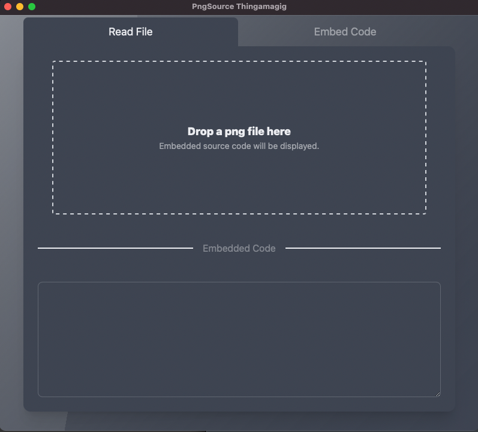

# PNGSource

A tool that makes it easy to embed source code in a PNG file. It can also read source code previously embedded, of course!

## Benefits

I detest losing source code, and I like creating diagrams using a descriptive language (be it YAML, UML, Python...) -- Diagrams.com (formerly Draw.io) lets users save their code alongside the generated PNG files. So, that's our prior art! (I tried to remain compatible with their encoding)

## What it does

If you provide PNGSource with the path to an existing PNG file (or drag/drop) it will display that file's decoded `text` chunk, if it exists.

You can also provide a PNG file and a text file (or enter text manually) and embed the text in the file, in a `text` chunk.

 ## What it does not do

There is no stenography involved here. Although I am planning on performing a few tests to see if this would let me embed a reasonable amount of code in any image format.

# Using

Simply download a CLI tool for your platform, or the GUI application (installer on Windows, disk image on MacOs, standalone on Linux)

Run the cli command with `--help` to see what you can do. The GUI app should be self explanatory (I hope!)

# Building

Only if you plan on contributing or need a different platform:

`make platforms VERSION=<semantic version>`

or

`make platforms BRANCH=<git branch> VERSION=<semantic version>`

or

`make platforms GO=<go version> BRANCH=<git branch> VERSION=<semantic version>`

Full-on release:

`make release` instead of `make platforms`

## Build dependencies

- hfsplus (OS package)
- hfsplus support in your kernel... you may have to rebuild a new kernel with `CONFIG_HFS_FS=y`
- pkg-config (OS package)
- libgtk-3-dev (OS package)
- libwebkit2gtk-4.0-dev (OS package)
- zip (OS package)
- nsis nsis-doc nsis-pluginapi (OS packages, Windows packager)
- yarn: `yarn install`

# FAQ

**Is this an Electron app?**

No. It is significantly smaller and less greedy than an Electron-based application. It does, however, rely on a combination of go, webview, tailwindcss and native dialogs.

**Why isn't it working for me?**

Please create an issue. If possible, include the files you were working with (image and code) so that I can reproduce the issue.
